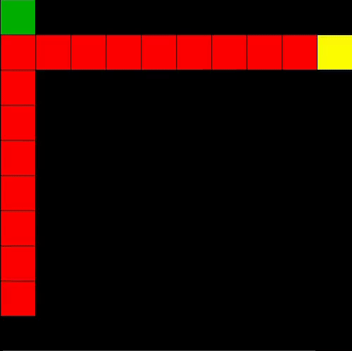

# RL Snake
---
## Description

### Train and play Q-Learning agent on snake game.

## Installation
Requires python=3.7 or above.
`pip install -r requirements.txt`

## Usage
### Play snake
`python play.py`

### Play snake by learned model
`python play.py -m <path_to_model>`

### Trainning
`python train_q.py`

## Contributing

## License
See license file

## Contact

## Acknowledgments

### Used modules
- [Game](https://github.com/Gantulga9480/Game.git) (v2s) - commit hash: 3f5f68caf8c0d7dd8cc12b36aa30358dc9975318
- [RL](https://github.com/Gantulga9480/RL.git) - commit hash: c9f5a31d00bceb93ee67aafaf47736f1b05fb478
